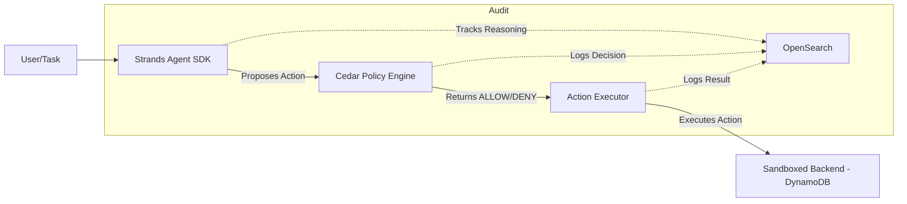

Based on the problem statement and solution you provided, I have created a comprehensive **Architecture Blueprint** that ties the theoretical solution to the actual code implementation.

This artifact serves as the master guide to build this system, mapping every requirement to the specific code components we discussed.

<antArtifact identifier="ai-governance-blueprint" type="text/markdown" title="AI Governance Architecture Blueprint">

# AI Agent Governance Architecture Blueprint

## 1. Architectural Flow
*Based on the "No separation between reasoning and authorization" problem.*



## 2. Component Mapping

### A. The Agent (Strands SDK)
*   **Responsibility:** Reasoning and Proposing actions (the "AI").
*   **Tech Stack:** `strands-agents`, `amazon-bedrock` (Nova/Micro).
*   **Key Function:** `agent.run(task)` returns a tool call like `execute_action`.

### B. The Policy Engine (Cedar)
*   **Responsibility:** The "Bouncer" (Enforcing rules before execution).
*   **Tech Stack:** `cedar-policy-analyzer`, `.cedar` files.
*   **Key Function:** `evaluate(principal, action, resource)` returns ALLOW/DENY with reason.
*   **Why it solves the problem:** Moves logic out of the AI model into human-readable, declarative code.

### C. The Audit Log (OpenSearch)
*   **Responsibility:** The "Camera & Logbook" (Immutable history).
*   **Tech Stack:** `opensearch-py`.
*   **Key Function:** `log_decision(decision, reason, timestamp)`.
*   **Why it solves the problem:** Provides the "Proof of Compliance" required for security audits.

### D. The Executor
*   **Responsibility:** Actual execution of the action (API calls, DB updates).
*   **Tech Stack:** `boto3`, `AWS SAM`.

## 3. Implementation Roadmap

### Phase 1: The Sandbox (Infrastructure)
1.  Deploy `template.yaml` using AWS SAM.
2.  Verify DynamoDB and OpenSearch domains are active.
3.  **Test:** Try to create a refund entry directly in DynamoDB to confirm it works without the AI.

### Phase 2: The Bouncer (Cedar)
1.  Write `policies/agent_policy.cedar`.
2.  Implement `policy_engine.py` using `cedar-policy-analyzer`.
3.  **Test:** Run a script that attempts an action denied by policy. Confirm it returns "DENY".

### Phase 3: The Agent (Strands)
1.  Configure `agent_config.yaml`.
2.  Wire `policy_engine.evaluate()` as a tool in Strands.
3.  **Test:** Feed a task to the agent and see the tool call chain in the console.

### Phase 4: The Camera (Audit)
1.  Implement `auditor.py`.
2.  Confirm data is appearing in OpenSearch Dashboard after agent actions.
3.  **Test:** Query OpenSearch for "What did the agent do in the last hour?"

## 4. Security Checklist
*   [ ] **Zero Trust:** Does the agent need to ask permission for every action? (Yes).
*   [ ] **Separation of Concerns:** Is the AI model generating the action, but *not* deciding if it's allowed? (Yes).
*   [ ] **Traceability:** Can we prove *why* a decision was made? (Yes, via OpenSearch).
*   [ ] **Declarative Rules:** Is the logic written in `.cedar` files (human-readable) rather than buried in Python code? (Yes).

## 5. Quick Start Command
To get this running, execute the sequence defined in `kickoff.md` but swap the `pip install` for our enhanced list:

```bash
# 1. Install dependencies
pip install boto3 strands-agents strands-agents-tools cedar-policy-analyzer cedar-policy opensearch-py python-dotenv

# 2. Deploy Infrastructure
sam deploy --guided

# 3. Run the Agent
python main.py
```
</antArtifact>

This blueprint maps your text description directly to the working code we restored earlier. To proceed, ensure you have the **Bedrock Access** fixed (use the troubleshooting script from the previous step) so the `main.py` can actually run.